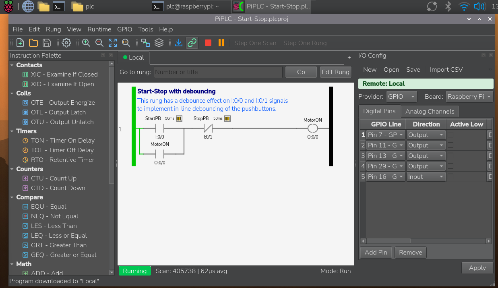

# PiPLC - Raspberry Pi Soft-PLC

A full-featured software PLC for Raspberry Pi and single-board computers, featuring a Qt-based ladder logic editor with drag-and-drop programming, virtual I/O simulation, and GPIO integration.

## What You Can Do

- Build ladder logic programs visually with drag-and-drop rungs and branches
- Simulate inputs and outputs without hardware
- Deploy to Raspberry Pi as a headless engine and connect remotely from the editor
- Map GPIO pins to PLC variables for real hardware control
- Run multiple independent PLC contexts with signal routing between them

## Highlights

- Visual Ladder Editor with 30 instruction types, parallel branches, undo/redo
- Contact Decorators for timers, counters, one-shots, and debounce filters
- Multi-Context Engines for up to 8 independent PLC contexts
- Remote Deployment with a headless engine server and editor connection
- Virtual I/O Simulation panel for testing without hardware
- GPIO Integration using libgpiod with configurable pin mapping
- Cross-Platform support for Windows, Linux x64, and ARM64 (Raspberry Pi)

## Getting Started (End Users)

1. Download the latest release for your platform.
2. Launch the editor application.
3. Create a new project and build your first ladder program.
4. Use the simulation panel to toggle inputs and verify outputs.
5. When ready, deploy the engine to your Raspberry Pi and connect remotely.

## Typical Workflow

1. Design ladder logic in the editor.
2. Validate behavior using virtual I/O simulation.
3. Map PLC variables to GPIO pins.
4. Deploy the engine to a Raspberry Pi and run headless.
5. Monitor live I/O and debug from the editor.

## Deployment Modes

- Desktop Mode: Run the editor and engine on the same machine.
- Remote Mode: Run the engine on a Raspberry Pi and connect from the editor.

## Hardware Integration Notes

- GPIO mappings are configured per project.
- Use safe defaults and test with simulation before switching to real outputs.
- Follow standard electrical safety practices when wiring relays or contactors.

## Supported Platforms

- Windows (x64)
- Linux (x64)
- Linux (ARM64, Raspberry Pi)

## Releases

This repository contains only official release artifacts and end-user documentation.

